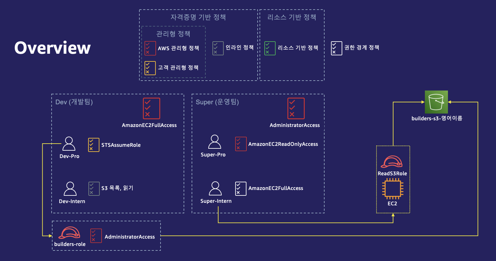
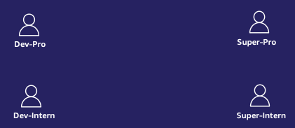
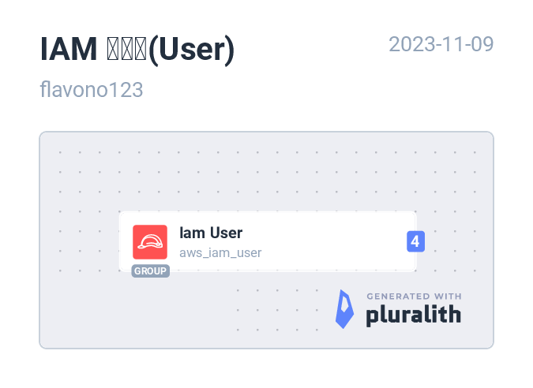
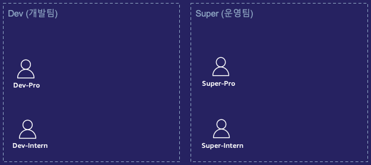
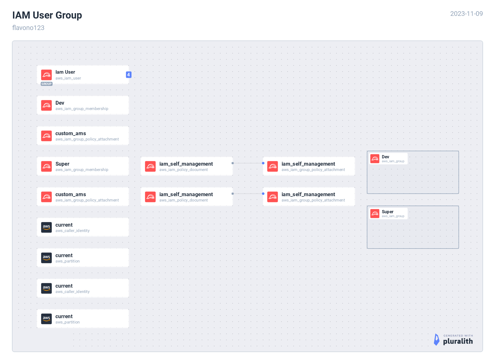
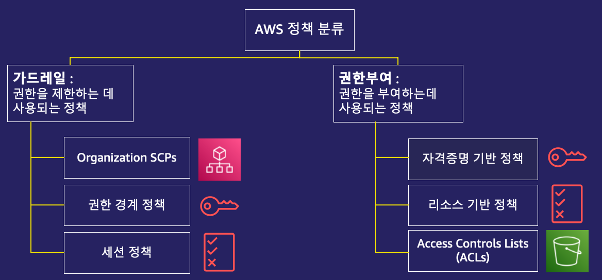
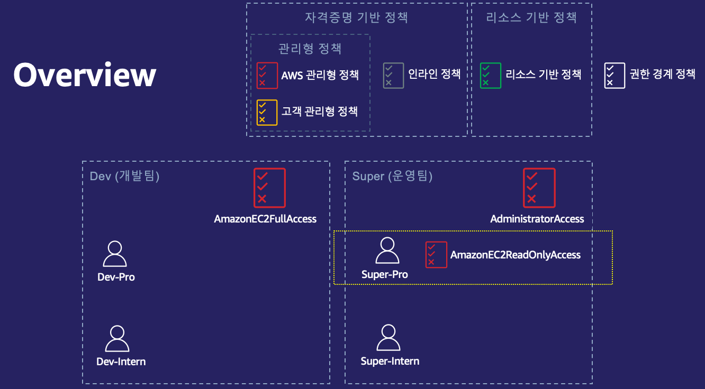
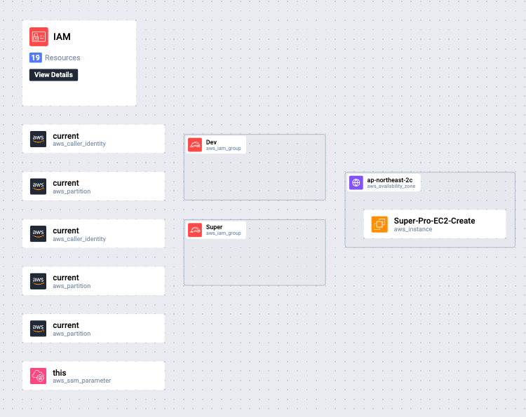

# [IAM Workshop](https://catalog.us-east-1.prod.workshops.aws/workshops/dd23d392-bea4-483c-aefd-f62ed73f936d/en-US)

## [IAM 사용자 및 사용자 그룹](https://catalog.us-east-1.prod.workshops.aws/workshops/dd23d392-bea4-483c-aefd-f62ed73f936d/en-US/iam-user-and-user-group)

### [IAM 사용자(User)](https://catalog.us-east-1.prod.workshops.aws/workshops/dd23d392-bea4-483c-aefd-f62ed73f936d/en-US/iam-user-and-user-group/iam-user)

### [IAM 사용자 그룹(User Group)](https://catalog.us-east-1.prod.workshops.aws/workshops/dd23d392-bea4-483c-aefd-f62ed73f936d/en-US/iam-user-and-user-group/iam-user-group)

## [IAM 정책(Policy)](https://catalog.us-east-1.prod.workshops.aws/workshops/dd23d392-bea4-483c-aefd-f62ed73f936d/en-US/iam-policies)

권한을 제한하는 정책 (Guardrail)

1. 조직 SCP 정책 (Organization SCPs)
2. 권한 경계 정책 (Permissions boundaries)
3. 세션 정책 (Session policies)

권한을 부여하는 정책 (Grant)

1. 자격증명 기반 정책 (Identity-based policies)
   1. AWS 관리형 정책 (AWS Managed policies): AWS에서 제공하는 글로벌 적용 가능 정책
   2. 고객 관리형 정책 (Customer Managed policies): 고객이 직접 생성하여 고객 계정에서만 사용 가능한 정책
   3. 인라인 정책 (In-line policies): 단일 사용자 그룹 역할에 직접 추가하는 정책 (재활용 불가)
2. 리소스 기반 정책 (Resource-based policies)
3. 액세스 제어 리스트 (Access Control Lists, ACLs)

### [자격증명 기반 정책(Identity-based policies)](https://catalog.us-east-1.prod.workshops.aws/workshops/dd23d392-bea4-483c-aefd-f62ed73f936d/en-US/iam-policies/identity-based-policies)

[**사용자 권한 추가 (AWS 관리형 정책)**](https://catalog.us-east-1.prod.workshops.aws/workshops/dd23d392-bea4-483c-aefd-f62ed73f936d/en-US/iam-policies/identity-based-policies#(aws-))

Super-Pro : AmazonEC2ReadOnlyAccess

