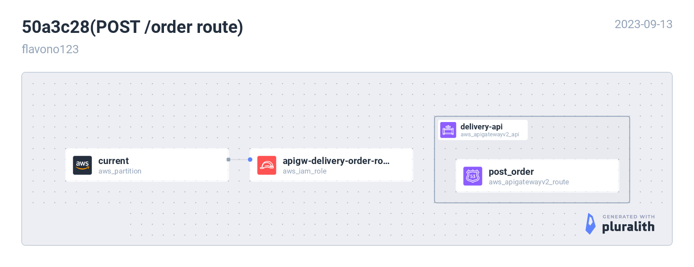
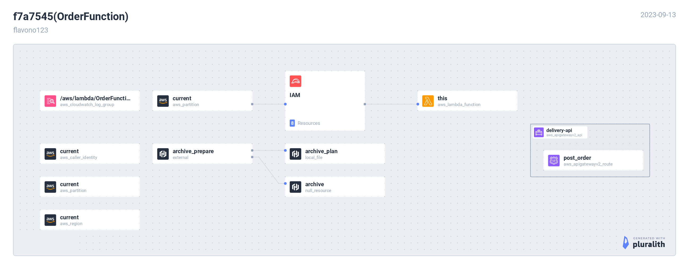

# [Serverless Workshop](https://catalog.us-east-1.prod.workshops.aws/workshops/4923c0ff-6470-46e1-9884-7c6ee63e7136/ko-KR)

## [시작 전 준비 사항](https://catalog.us-east-1.prod.workshops.aws/workshops/4923c0ff-6470-46e1-9884-7c6ee63e7136/ko-KR/start)

- [사전 환경 구성(IAM Role)](https://catalog.us-east-1.prod.workshops.aws/workshops/4923c0ff-6470-46e1-9884-7c6ee63e7136/ko-KR/start/cloudformation)
  - CloudFormation -> HCL

## [간단한 배달 주문 서비스 만들기](a://catalog.us-east-1.prod.workshops.aws/workshops/4923c0ff-6470-46e1-9884-7c6ee63e7136/ko-KR/simple-api-service)

### [API Gateway 생성하기](https://catalog.us-east-1.prod.workshops.aws/workshops/4923c0ff-6470-46e1-9884-7c6ee63e7136/ko-KR/simple-api-service/create-apigw)

### [주문 처리 Lambda 함수 작성하기](https://catalog.us-east-1.prod.workshops.aws/workshops/4923c0ff-6470-46e1-9884-7c6ee63e7136/ko-KR/simple-api-service/create-lambda)

