# [Serverless Workshop](https://catalog.us-east-1.prod.workshops.aws/workshops/4923c0ff-6470-46e1-9884-7c6ee63e7136/ko-KR)

## [시작 전 준비 사항](https://catalog.us-east-1.prod.workshops.aws/workshops/4923c0ff-6470-46e1-9884-7c6ee63e7136/ko-KR/start)

- [사전 환경 구성(IAM Role)](https://catalog.us-east-1.prod.workshops.aws/workshops/4923c0ff-6470-46e1-9884-7c6ee63e7136/ko-KR/start/cloudformation)
  - CloudFormation -> HCL

## [간단한 배달 주문 서비스 만들기](a://catalog.us-east-1.prod.workshops.aws/workshops/4923c0ff-6470-46e1-9884-7c6ee63e7136/ko-KR/simple-api-service)

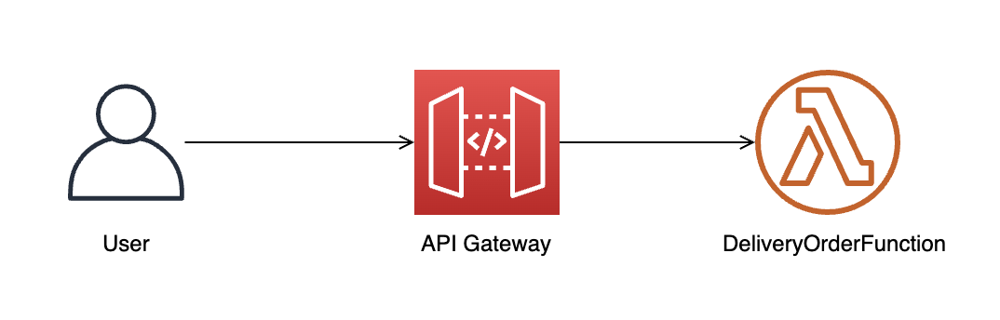

### [API Gateway 생성하기](https://catalog.us-east-1.prod.workshops.aws/workshops/4923c0ff-6470-46e1-9884-7c6ee63e7136/ko-KR/simple-api-service/create-apigw)


### [주문 처리 Lambda 함수 작성하기](https://catalog.us-east-1.prod.workshops.aws/workshops/4923c0ff-6470-46e1-9884-7c6ee63e7136/ko-KR/simple-api-service/create-lambda)


### [API Gateway를 Lambda 함수에 연결하기](https://catalog.us-east-1.prod.workshops.aws/workshops/4923c0ff-6470-46e1-9884-7c6ee63e7136/ko-KR/simple-api-service/integ-apigw-lambda#api-gateway)

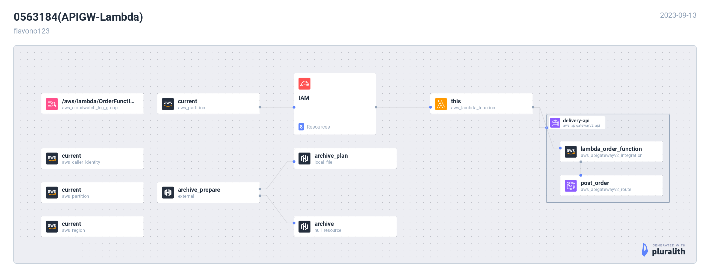

## [비동기 처리 모델로 변경하기](https://catalog.us-east-1.prod.workshops.aws/workshops/4923c0ff-6470-46e1-9884-7c6ee63e7136/ko-KR/api-async)

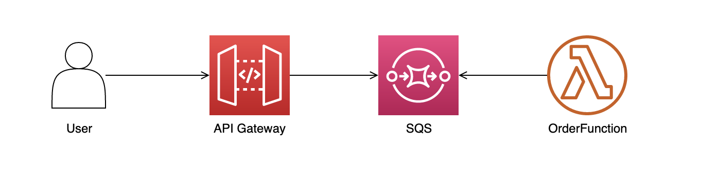

### [SQS 구성하기](https://catalog.us-east-1.prod.workshops.aws/workshops/4923c0ff-6470-46e1-9884-7c6ee63e7136/ko-KR/api-async/create-sqs)

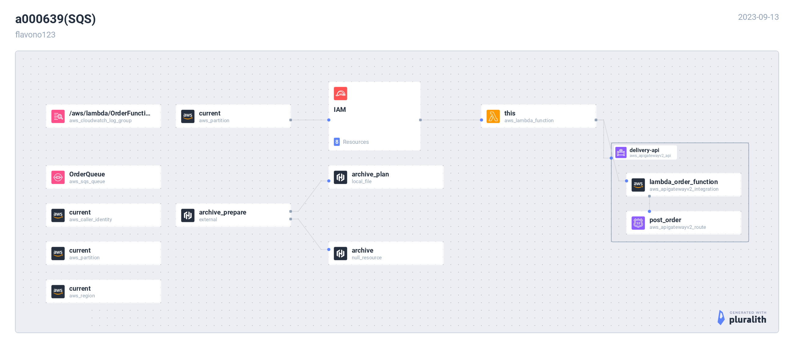

### [API Gateway, Lambda를 SQS에 연결하기](https://catalog.us-east-1.prod.workshops.aws/workshops/4923c0ff-6470-46e1-9884-7c6ee63e7136/ko-KR/api-async/integration)

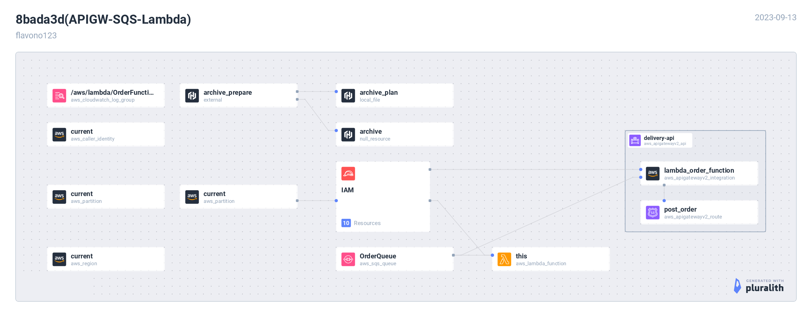

### [Dead-letter queue 적용하기](https://catalog.us-east-1.prod.workshops.aws/workshops/4923c0ff-6470-46e1-9884-7c6ee63e7136/ko-KR/api-async/dead-letter-queue)

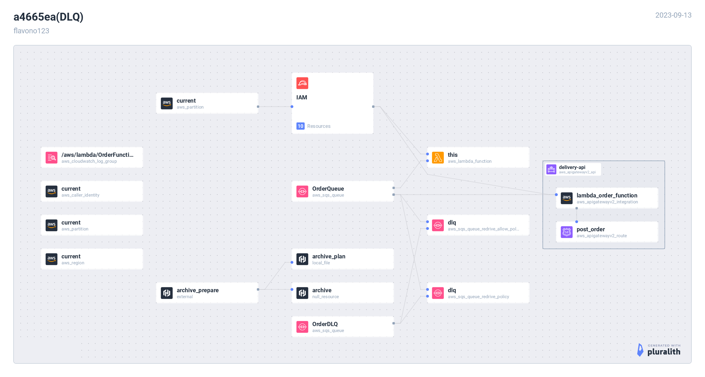

## [EventBridge를 사용한 Event-driven 모델 적용하기](https://catalog.us-east-1.prod.workshops.aws/workshops/4923c0ff-6470-46e1-9884-7c6ee63e7136/ko-KR/eventbridge)

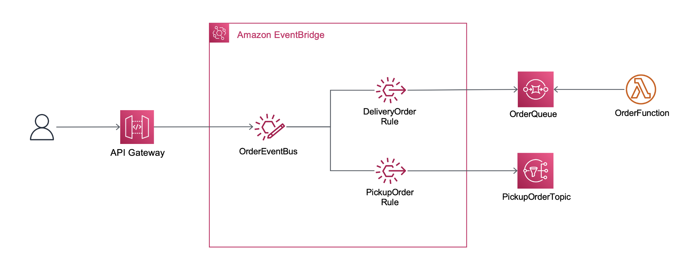

### [EventBridge를 구성하고 SQS에 연결하기](https://catalog.us-east-1.prod.workshops.aws/workshops/4923c0ff-6470-46e1-9884-7c6ee63e7136/ko-KR/eventbridge/create-eventbridge)

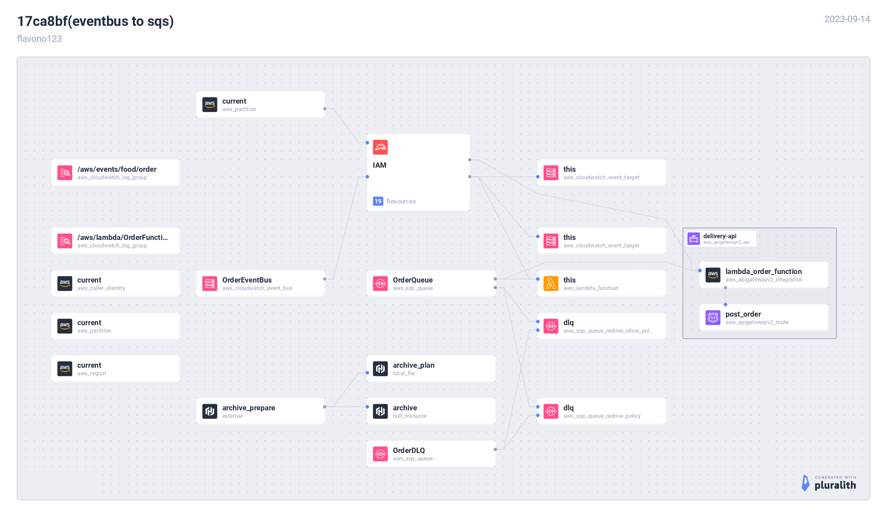

### [API Gateway를 EventBridge에 연결하기](https://catalog.us-east-1.prod.workshops.aws/workshops/4923c0ff-6470-46e1-9884-7c6ee63e7136/ko-KR/eventbridge/apigw-eb)

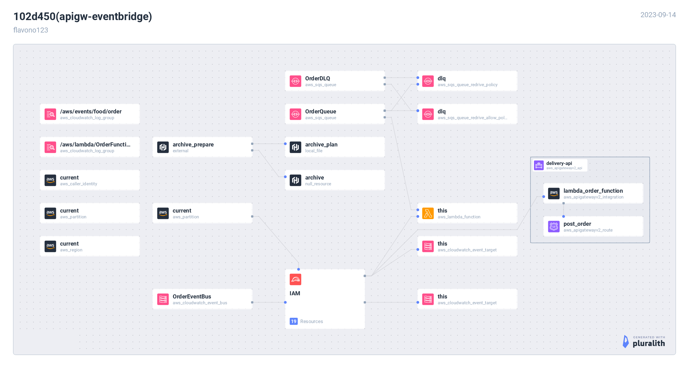

### [픽업 주문 메시지 처리 구성](https://catalog.us-east-1.prod.workshops.aws/workshops/4923c0ff-6470-46e1-9884-7c6ee63e7136/ko-KR/eventbridge/pickup-order)

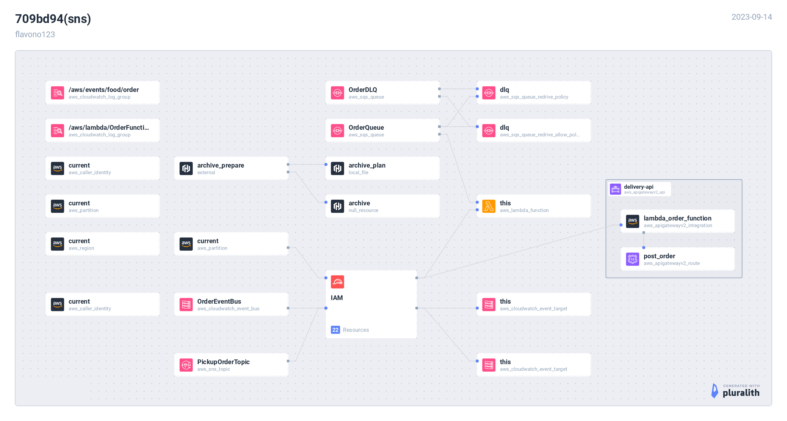

### [EventBridge를 SNS에 연결하기](https://catalog.us-east-1.prod.workshops.aws/workshops/4923c0ff-6470-46e1-9884-7c6ee63e7136/ko-KR/eventbridge/pickup-eb-sns)

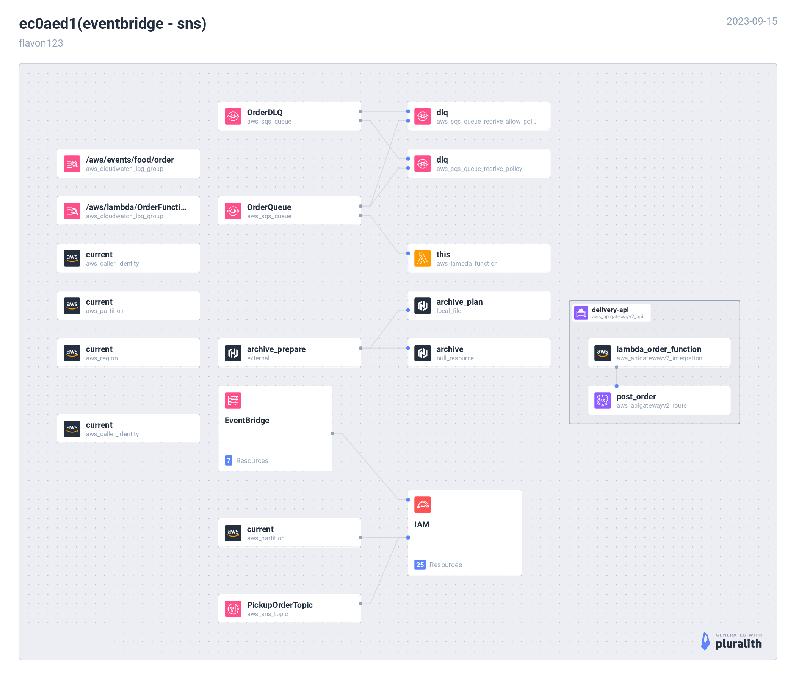

## 리소스 정리하기

```bash
terraform destroy
```
