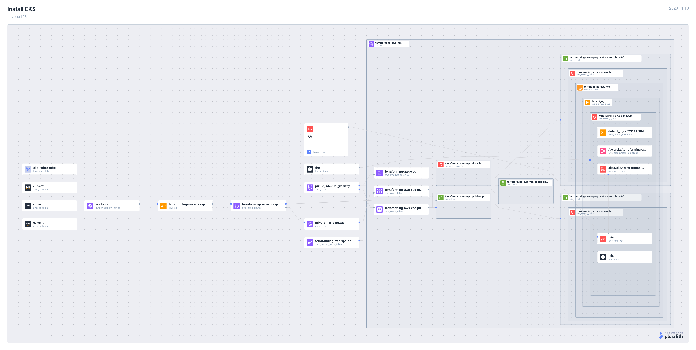
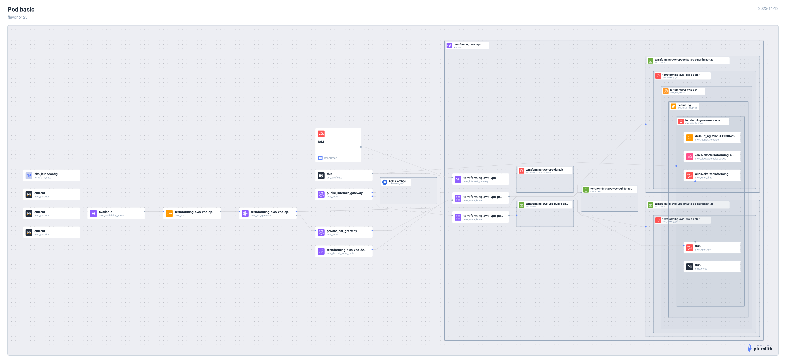
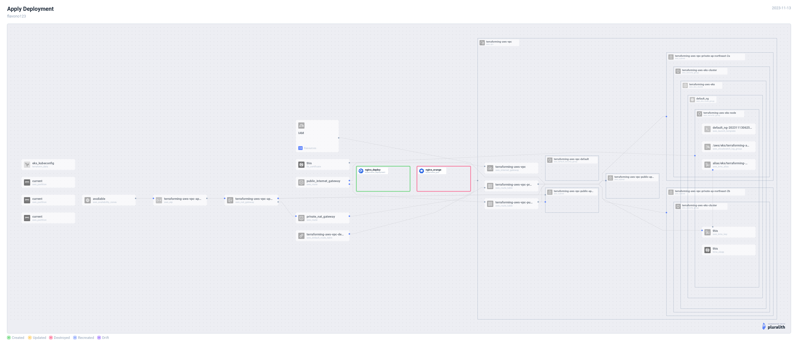
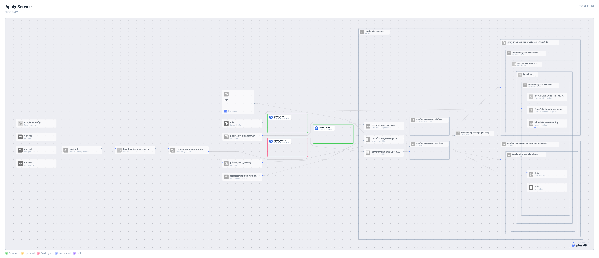
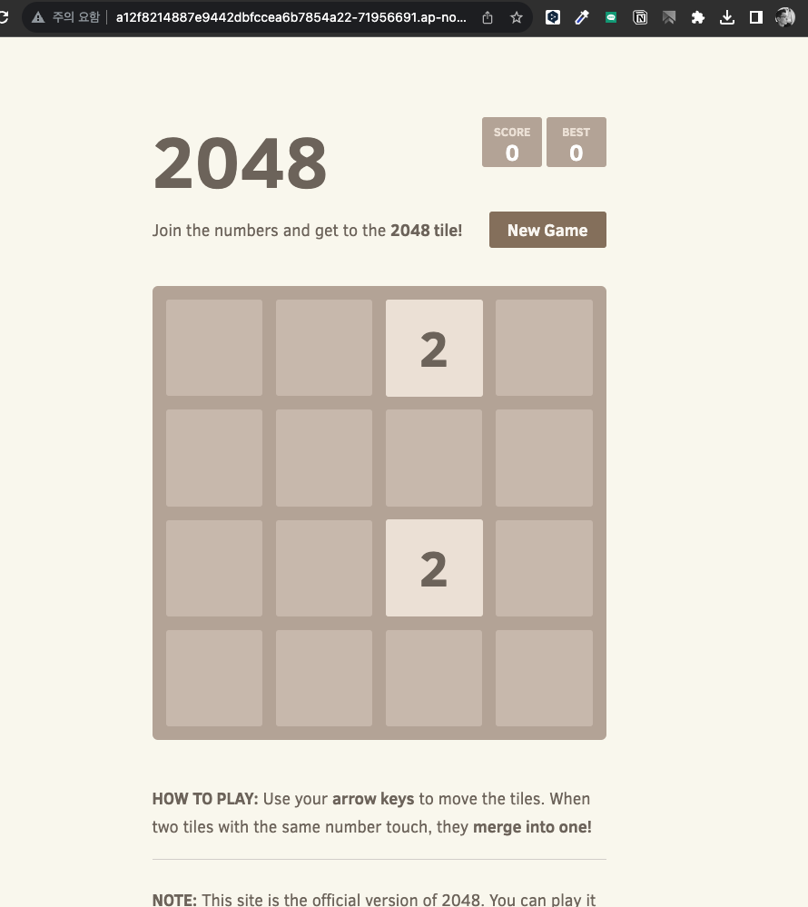

# [AWS Builders Korea - Docker and EKS 시작하기](https://catalog.us-east-1.prod.workshops.aws/workshops/46236689-b414-4db8-b5fc-8d2954f2d94a/ko-KR)

**🔊 Notice**
- 다음 두 개 섹션 건너 뜀
  - [Cloud9 IDE 환경 구성](https://catalog.us-east-1.prod.workshops.aws/workshops/46236689-b414-4db8-b5fc-8d2954f2d94a/ko-KR/install); 로컬 터미널/IDE에서 실습
  - [Docker](https://catalog.us-east-1.prod.workshops.aws/workshops/46236689-b414-4db8-b5fc-8d2954f2d94a/ko-KR/docker)
    - community 초과 등급의 테라폼 프로바이더가 없음
    - 테라폼으로 IaC 구성 학습할 필요성이 적음

## [EKS](https://catalog.us-east-1.prod.workshops.aws/workshops/46236689-b414-4db8-b5fc-8d2954f2d94a/ko-KR/eks)

### [EKS 설치](https://catalog.us-east-1.prod.workshops.aws/workshops/46236689-b414-4db8-b5fc-8d2954f2d94a/ko-KR/eks/10-install)



```sh
❯ k get no
NAME                                             STATUS   ROLES    AGE   VERSION
ip-10-0-23-182.ap-northeast-2.compute.internal   Ready    <none>   21m   v1.28.3-eks-4f4795d
ip-10-0-30-110.ap-northeast-2.compute.internal   Ready    <none>   19m   v1.28.3-eks-4f4795d
```

### [Pod 기본 명령어](https://catalog.us-east-1.prod.workshops.aws/workshops/46236689-b414-4db8-b5fc-8d2954f2d94a/ko-KR/eks/20-pod)



```sh
❯ k get po -owide
NAME           READY   STATUS    RESTARTS   AGE   IP           NODE                                             NOMINATED NODE   READINESS GATES
nginx-orange   1/1     Running   0          72s   10.0.1.250   ip-10-0-30-110.ap-northeast-2.compute.internal   <none>           <none>
```

### [ReplicaSet 배포](https://catalog.us-east-1.prod.workshops.aws/workshops/46236689-b414-4db8-b5fc-8d2954f2d94a/ko-KR/eks/30-replicaset)

🔊 [kubernetes provider](https://registry.terraform.io/providers/hashicorp/kubernetes/latest/docs/resources/pod_v1)에서 지원하지 않는 리소스이기 때문에 건너뜀

### [Deployment 배포](https://catalog.us-east-1.prod.workshops.aws/workshops/46236689-b414-4db8-b5fc-8d2954f2d94a/ko-KR/eks/40-deployment)



```sh
❯ k get deploy,rs,po
NAME                           READY   UP-TO-DATE   AVAILABLE   AGE
deployment.apps/nginx-deploy   3/3     3            3  21s

NAME                                      DESIRED   CURRENT   READY   AGE
replicaset.apps/nginx-deploy-666c6fbf69   3         3         3       21s

NAME                                READY   STATUS    RESTARTS   AGE
pod/nginx-deploy-666c6fbf69-ghfdh   1/1     Running   0          20s
pod/nginx-deploy-666c6fbf69-jzv4m   1/1     Running   0          21s
pod/nginx-deploy-666c6fbf69-sv9j2   1/1     Running   0          20s
```

### [Service 배포](https://catalog.us-east-1.prod.workshops.aws/workshops/46236689-b414-4db8-b5fc-8d2954f2d94a/ko-KR/eks/50-loadbalancer)



```sh
❯ k get deploy,svc
❯ k get deploy,svc
NAME                        READY   UP-TO-DATE   AVAILABLE   AGE
deployment.apps/game-2048   3/3     3            3           4m31s

NAME                 TYPE           CLUSTER-IP      EXTERNAL-IP                                                                  PORT(S)        AGE
service/game-2048    LoadBalancer   172.20.53.228   a12f8214887e9442dbfccea6b7854a22-71956691.ap-northeast-2.elb.amazonaws.com   80:31822/TCP   4m31s
service/kubernetes   ClusterIP      172.20.0.1      <none>                                                                       443/TCP        93m
```


### [Namespace 배포](https://catalog.us-east-1.prod.workshops.aws/workshops/46236689-b414-4db8-b5fc-8d2954f2d94a/ko-KR/eks/60-namespace)


```sh
❯ k get po -n mynamespace
NAME    READY   STATUS    RESTARTS   AGE
nginx   1/1     Running   0          108s
```
